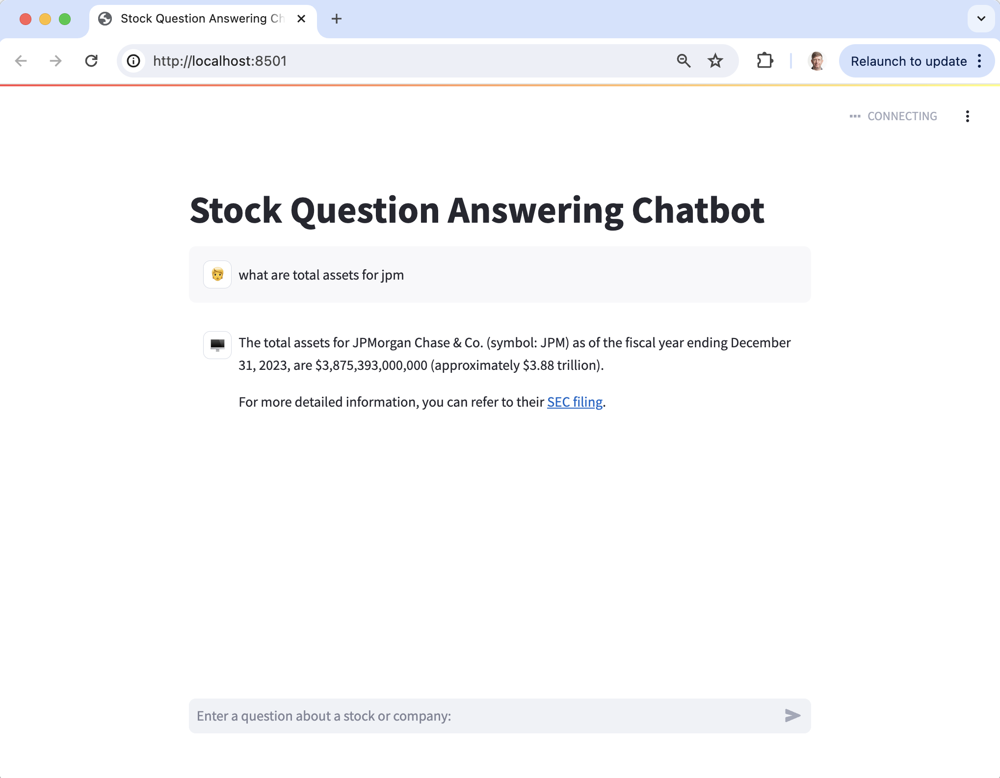

 - clone the repo
 - create a new environment
 ```python
 conda create --name openbb_agent python=3.11
 conda activate openbb_agent
 ```
 - Install python dependencies
 ```python
 pip install -r requirements.txt
 ```
 - For the demo make a free account with OpenBB, FMP, other services as desired
 - create a `.env` file with credentials to APIs, similar to `dotenv.txt` in the repo. 
 - Run the Streamlit demo
 ```
 streamlit run streamlit_bbagent.py`
 ```
 
